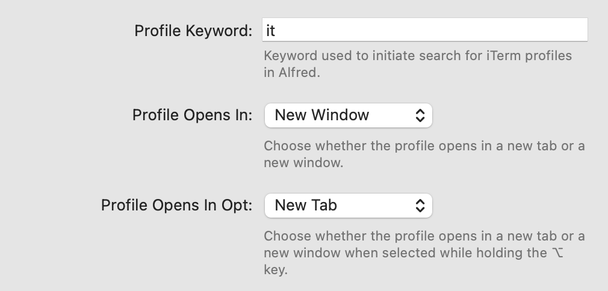

# iTerm Toolkit Workflow for [Alfred](http://www.alfredapp.com)

Install this iTerm Toolkit Workflow in [Alfred](http://www.alfredapp.com)
to make it easy to search for and open iTerm profiles, and to run shell
commands in iTerm sessions.

## Installation

## Features

iTerm Toolkit has four key features which streamline your interactions with
[iTerm](https://iterm2.com/) and the shells which run inside of it.

### Open an iTerm profile

If you only have one or two iTerm profiles, this feature won't be useful to you.
Many iTerm users have a lot of profiles, say for example one profile for each server
they log in to. You can easily launch any of these profiles from Alfred.

- Activate Alfred (I use Control-Option-Shift-Command-Space, aka Hyper-Space)
- Type the Profile Keyword you have set in the iTerm Toolkit Workflow Configuration.
  The default is `it`.
- Select an iTerm profile by typing any of the characters in the name of the
  desired iTerm profile (no need to type a space), and/or use the up and down
  arrow keys
- Press return (or hold ⌥ and press return) to open the iTerm profile

The profile will open in a new window or tab depending on your configuration
settings for iTerm Toolkit.

### Run a shell command from the Alfred prompt

Alfred includes a native feature called Terminal for running a shell command from the
Alfred prompt. This feature has some limitations: you only have 7 choices for the prefix
character, and you can't use a prefix that's longer than one character. You also
have to download and edit a [custom AppleScript](https://github.com/vitorgalvao/custom-alfred-iterm-scripts)
to choose the behavior you want (open in new tab vs new window) for iTerm.

iTerm Toolkit gives you much more flexibility:

- The required AppleScript that works great with iTerm is already included
- You can choose any keyword to run a command, so you could choose "sh" if you want
- You can run the command in a new tab, a new window, or in the current iTerm session
- You can configure how the command is run when you hold down the ⌥ (option) key. For
  example, you could have the command run in a new tab normally, but if you hold ⌥
  then the command will run in a new window
- If running in a new tab or window, you can choose the iTerm profile which will be used
- You can change all the settings in the workflow configuration screen, no script editing
  required.

To run a command from the Alfred prompt:

- Activate Alfred (I use Control-Option-Shift-Command-Space, aka Hyper-Space)
- Type the Command Keyword you have set in the iTerm Toolkit Workflow Configuration.
  The default is `$`
- Type a space, then type your shell command and hit return (or hold ⌥ and hit return)

The command will be run in a new window, tab, or session depending on your configuration
settings for iTerm Toolkit.

### Run a shell command from a Universal Action

iTerm toolkit includes a Universal Action to run the selected text as a shell
command in iTerm. This method uses the same settings and configuration used when
running a shell command from the Alfred prompt.

- Select some text containing a shell command you want to run
- Activate Alfred's Universal Action feature (I use Shift-Command-Space)
- Type "iterm" to select the "Run as shell command in iTerm" action
- Press return (or hold ⌥ and hit return) to execute the shell command

The command will be run in a new window, tab, or session depending on your configuration
settings for iTerm Toolkit.

### Open a new iterm window

- activate Alfred
- use the 'iterm' keyword and press space
- see the list of profiles you have configured in iterm
- select one of them
- a new window or tab opens with that profile

### Open an shell in an iTerm window at a selected path

You can open a new iTerm session in any directory you can select in Alfred.

- Use Alfred's [File Search or File Navigation](https://www.alfredapp.com/help/features/file-search/)
feature to select a directory
- Press tab
- type 'iterm' and select 'Open new iTerm session here'
- Press return (or hold ⌥ and hit return)

A new iTerm window or tab (depending on your configuration) with the shell in the
selected directory.

## Configuration

To access iTerm Toolkit configuration:

- Open Alfred Settings
- Select  `Workflows` in the sidebar
- Select `iTerm Toolkit`
- Click the `Configure Workflow...` button

**Profile Keyword**

Enter any combination of letters, numbers, and symbols. Whatever you enter
here will be the keyword you will type to search for iTerm profiles. When
searching, you don't need to type a space between this keyword and the name
of the profile you are searching for.

**Profile Opens In**

Choose whether a selected profile will open in a `New Window` or a
`New Tab`. If set to `New Tab` and there isn't an existing iTerm window
open, the profile will open in a new window.

**Profile Opens In Option**

Choose whether the profile will open in a new window or a new tab while
selected with the option key pressed. If you set **Profile Opens In** to
`New Window`, you probably want to set this to `New Tab`. If set to `New Tab`
and there isn't an existing iTerm window open, the profile will open in a new
window.

**Command Keyword**

**Command Runs In**

**Command Runs In Option**

**Command Profile**

**iTerm Opens Quietly**

**Delay Before Typing Command**

## Credits and Inspiration

This toolkit was inspired by and uses ideas and code from the following
projects:

- https://github.com/jessedobbelaere/alfred-iterm-profiles-workflow
